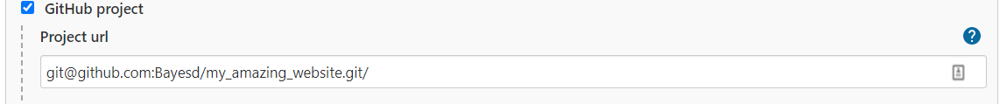
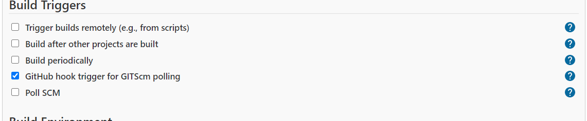
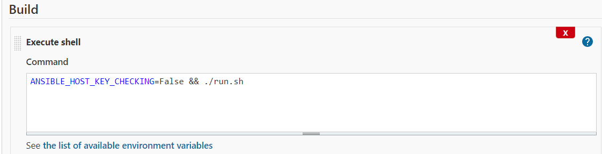
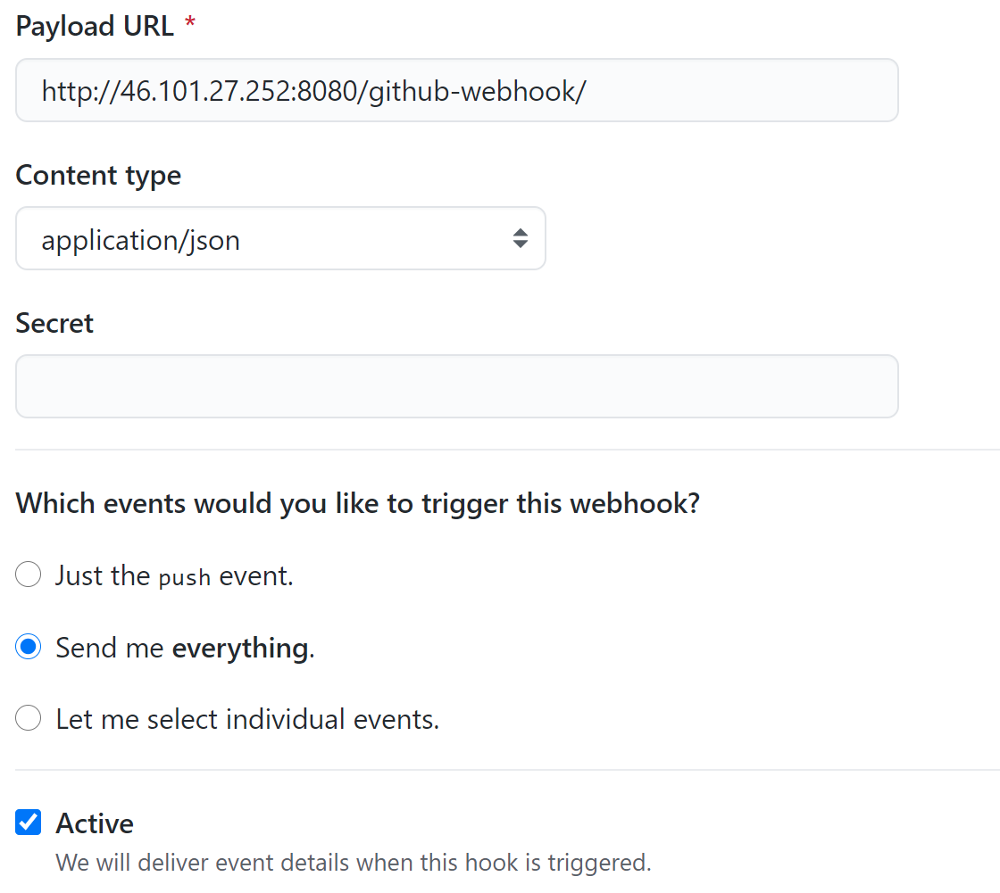

# Inlämningsuppgift, Automationsramverk


### Leo Möller


# Del 1- Frågor


### 1.1. Vad för typ av historia kan man se i ett verktyg såsom Jenkins?

Build historik, d.v.s. historik som visar information om ett Jenkins-jobb varje gång det körs.


### 1.2. Vad för typ av historia kan man se i ett verktyg såsom Git?

Versionshistorik, d.v.s. information om Git repository:t som kan hämtas med kommandot git log.


### 1.3. Vad är en pipeline i Jenkins?

Pipeline i Jenkins är ett sätt att konfigurera ett jobb i jenkins. Pipelines skrivs i språket Groovy och olika delar som ingår i bygge, testning delas in i olika steg/stages.


### 1.4. Beskriv vad Jenkins är samt alternativ till Jenkins

Jenkins är ett automatiseringsverktyg kör som en server och används för att integrera olika verktyg som används i bygge, testning och deployement av mjukvara.

Alternativ till Jenkins är GitLab, Bamboo från Atlassian, CircleCI och TeamCity från JetBrains.


### 1.5. Beskriv vad Ansible är samt alternativ till Ansible

Ansible är ett så kallat Configuration Management verktyg som används för att automatisera konfigureringar, i s.k. playbooks, så att de endast behöver skrivas vid ett tillfälle och sedan återanvändas. Alternativ till ansible är Puppet, Chef och Salt.

  


# Del 2 - Ansible mot en webbserver

Jag har 2 webbservrar med Debian, den ena kommer att agera webbserver där jag kör hemsidan ifrån, den andra kallar jag för ansible servern och det är därifrån jag kommer att köra ansible playbooks.

För att kunna köra ansible playbooks och deploya hemsidan på webserver så använder jag mig av ssh-nycklar. Jag börjar med att generera ett nyckelpar som root-användare på min ansible server.


```
ssh-keygen -t rsa -b 4096 -C "root@46.101.27.252"
```


Detta genererar två filer, en som heter “id_rsa” och innehåller den privata nyckeln för användaren och en som heter “id_rsa.pub” som innehåller den publika nyckeln. Den publika nyckeln kopierar jag över till filen “authorized_keys” på webbservernDen privata nyckeln gör jag ingenting med i detta steget.

Nästa steg är att uppdatera apt och installera ansible på ansible-servern.


```
apt-get update
apt install ansible
```


Nu skapar jag en filstruktur för mitt project som ser ut på följande vis.


```
.
└── project
    ├── inventory.yml
    ├── playbooks
    │   ├── lighttpd.yml
    │   ├── sync_site.yml
    │   └── website
    │       └── index.html
    └── run.sh
```


Filen run.sh är gör jag även körbar med 


```
chmod +x run.sh
```


Jag öppnar därefter filen med vim och ger instruktioner för vilka playbooks ansible ska köra.


```
ansible-playbook -i inventory.yml playbooks/lighttpd.yml
ansible-playbook -i inventory.yml playbooks/sync_site.yml
```


Därefter redigerar jag min inventory.yml fil. I denna filen ska jag skriva in vilken host jag vill ansluta till med playbooken, detta blir min Lighttpd server samt vilka variabler jag vill använda i projektet, om några. För detta projektet krävs det inte mycket.


```
webserver:
  hosts:
    138.68.129.223
  vars:
    domain: html
    ansible_user: root
    ansible_connection: ssh
    ansible_ssh_private_key_file: ~/.ssh/id_rsa
```


De tre sista variablerna som börjar med “ansible_”  kallas inte av de playbooks som jag skriver utan används av ansible för att utföra ssh inloggningen i bakgrunden. \
De säger att jag vill ansluta som root användare till maskinen med ip 138.68.129.223 över ssh och säger även vart min privata ssh nyckel ligger på maskinen som kör ansible koden. \
Den publika ssh nyckeln ligger på maskinen med ip adressen som anges under hosts.

Nästa steg är att konfigurera installationen av Lighttpd genom ansible playbooken på Lighttpd-servern. Detta gör jag i lighttpd.yml filen. 


```
- hosts: webserver
  become: yes
  tasks:

  - name: 'apt-get update'
    apt:
      update_cache: yes
      cache_valid_time: 3600
  
  - name: 'install lighttpd'
    apt: 
      name: ['lighttpd']
      state: latest

  - name: 'restart lighttpd'
    systemd: 
      name: lighttpd
      state: restarted
```


Först hämtar jag hosts variabeln och kallar den webserver. Därefter säger jag att jag vill bli root användare med rad två. Efter det har jag tre tasks. Första tasken uppdaterar apt på Lighttpd servern. Detta hade kunnat göras med ett shell script istället:


```
- name: 'apt-get update'
  shell: 'apt-get update'
```


Fördelen med att använda apt är att det är en modul i ansible och således finns det finesser med det alternativet. I just denna punkten spelar det ingen roll men i de kommande stegen hade det gjort det. Det har delvis att göra med felmeddelandena som dyker upp ifall det skulle bli något problem när playbooken körs som jag förstår det.

Nästa task använder apt-modulen i ansible för att installera den senaste versionen apt har registrerad för ansible.

Jag lade även in den sista tasken ifall att lighttpd servicen redan skulle vara installera men inaktiv på lighttpd-servern. Det försäkrar att Lighttpd kommer att starta om varje gång jag kör denna playbooken.

Jag gjorde även en playbook för att kunna uppdatera hemsidan, sync_site.yml. 


```
- hosts: webserver
  tasks:
  - name: 'copy file index.html'
    copy:
      src: website/
      dest: /var/www/{{ domain }}
```


I denna tas enbart en kopia av allt som ligger i “website”-directory:t och läggs i destinationen /var/www/html på Lighttpd-servern. {{ domain }} hämtar värdet för domain variabeln, som definierats i inventory.yml.

Slutligen skapar jag även en enkel “hello world” html sida i index.html men eftersom det inte är viktigt för uppgiften tar jag inte upp koden här.

Jag tror att jag vid detta steget initierade git i min project-directory, skapade ett GitHub repo och pushade koden dit.

Eftersom min run.fil var körbar kunde jag, när jag stod i min “project” mapp i terminalen köra min kod enbart genom att skriva 


```
./run.sh
```


Om jag då går in på IP adressen som ser jag min hemsida \
 \


# Del 2 - Github, Jenkins mot en webbserver

För att installera Jenkins på min webbserver krävs några steg extra eftersom Jenkins kräver att Java finns installerat på maskinen. Jag har följt instruktionerna på denna sidan för att installera jenkins och konfigurera Jenkins: [https://phoenixnap.com/kb/install-jenkins-on-debian-10](https://phoenixnap.com/kb/install-jenkins-on-debian-10).

Eftersom min webbläsare har svensk inställning installerade jag locale-pluginen så att jag kunde ändra språk till engelska. Jag valde även de plugins som hade med GitHub att göra, i övrigt bara rekommenderade plugins. Jag gick sedan in på “New Item” och valde Freestyle project och började med att länka mitt GitHub projekt.





Viktigt med den sista “/” här för att Jenkins ska hamna rätt i projektet. \
Nästa steg var att konfigurera Source Code Management.


Jag lade in den privata ssh nyckeln, id_rsa, från jenkins användaren på Jenkinsservern här genom att trycka på “Add” under “Credentials”. Där valde jag “SSH Username with private key” och bockade i “Enter directly” för att få upp ett ställe att klistra in den privata nyckeln.





Som Build Trigger bockade jag i “GitHub hook trigger for GITScm polling” vilket jag antar öppnar upp subdomänen “/github-webhook/” för jobbet men jag är inte säker på vad den gör.





Slutligen lade jag in en “Execute Shell” funktion under Build steget för att kunna köra ansible genom Jenkins.


```
ANSIBLE_HOST_KEY_CHECKING=False
```


Gör att ssh inloggningen inte frågar om passphrasen till ssh nyckeln. Om det promptet kommer så kommer jobbet inte att gå igenom via Jenkins.  \
Detta går även att ändra i ansibles konfigurationsfil, men det bästa sättet borde vara att lägga in raden som finns i konfigurationsfilen i en konfigurationsfil som skickas med i projektet i en templates mapp, eftersom det är där ansible letar efter konfigurationsfiler. \
Jag har inte gjort det här utan nöjer mig med att skicka med kommandot med jenkins och köra det innan jag kör run.sh, det funkar alldeles utmärkt. \
Jag bifogar en pdf över hela Jenkinsjobbet med rapporten. \
 \
När jag nu har gjort klart i Jenkins så har jag GitHub kvar att konfigurera.  \
Eftersom jag använder ssh adresserna så behöver jag lägga in min publika nyckel antingen global på mitt GitHub konto eller lokalt i repot. Jag väljer att lägga det globalt. Jag går då in i de globala inställningarna och väljer “SSH and GPG keys” för att kunna skapa en ny SSH-nyckel och kopiera in innehållet i filen id_rsa.pub från jenkins användaren på Jenkinsservern.

Därefter går jag tillbaka till mitt repo och går in i repots inställningar och väljer “Webhooks” och “Add webhoook”.





Detta är mina inställningar för webhooken. 

Jag gör en förändring i min index.html fil, commitar och pushar förändringen. \
Resultatet kan ses på [http://46.101.27.252/](http://46.101.27.252/)


